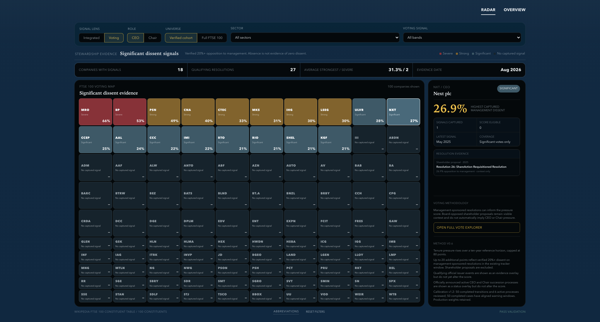

# Proxy Wars

Proxy Wars is a focused FTSE 100 governance research portfolio project built around one integrated Governance Radar:

- **Governance Radar**: the main source-backed FTSE 100 research surface, with integrated leadership-pressure and significant-voting lenses alongside profit-warning evidence, active succession processes, and tenure-period market performance.
- **Vote Explorer**: the supporting resolution-level workspace for verified significant shareholder dissent against management.

The Radar is the primary product. Vote Explorer remains available from the overview and company evidence rail for specialist cross-company and resolution-level analysis; it is not presented as a competing top-level module. The product remains intentionally transparent about scope: leadership evidence covers the current 100-company roster, externally managed issuers without a company CEO are marked not applicable, and voting evidence covers significant dissent rather than general AGM voting books.

## Preview




## Current coverage

### Governance Radar

- Universe: a 100-company FTSE 100 public constituent snapshot.
- Leadership coverage: all 100 companies have official issuer sources for current CEO and Chair appointments or a sourced structural `not applicable` designation.
- Signals in methodology `v0.6`: role tenure, qualifying registered dissent, source-verified profit-warning evidence, and officially announced live CEO or Chair succession processes.
- Profit-warning audit: all 100 companies reviewed over 36 months, with 16 qualifying official events across 12 issuers as of 15 August 2026.
- Succession review: all 100 companies reviewed, with seven live processes captured in the current evidence window.
- Market-performance coverage: all 100 companies with monthly share-price and dividend-adjusted returns against the FTSE 100 price index.
- Calibration audit: 50 completed transitions and six active processes compared with 188 current role observations; all 50 completed cases now have complete aligned warning windows, while live weights remain unchanged.
- Leadership profiles: all 100 companies have source-backed CEO/Chair profile access. Thirty priority issuers have concise career biographies; the remaining 70 intentionally use appointment-only summaries from official evidence.
- Excluded for now: activism, controversies, broader news, and any unlicensed claim to institutional-grade TSR.
- Output: `public/data/leadership-radar.json`.

The score is a research-prioritisation device, not a prediction that an individual will leave office. Full details are in [the radar methodology](docs/leadership-radar-methodology.md).

### Proxy Voting

- 33 real significant management-dissent resolutions across 22 matched FTSE 100 issuers in the current dataset.
- Primary layer: [Investment Association Public Register](https://www.theia.org/public-register).
- Verification layer: official issuer announcements and selected issuer-published AGM result PDFs.
- Direct issuer layer: 61 complete meeting tables are re-fetched weekly; 645 resolution rows have been parsed from 31 issuer PDFs. Five post-register meetings are now reviewed, with three qualifying BP resolutions published from the 2026 AGM.
- Focus: 20%+ opposition on remuneration, director elections, capital authorities, and other board-accountability resolutions.
- Vote direction: management-sponsored motions use votes against; board-opposed shareholder proposals use votes for. Raw vote outcomes remain visible on each detail page.
- Output: `public/data/tracker-data.json`.

The IA Public Register stopped adding new cases after its October 2025 policy change. It remains useful as a historical base; configured direct issuer sources now extend the ingestion path beyond that date without publishing routine sub-threshold resolutions.

## Stack

- React 19, TypeScript, and Vite
- React Router
- Recharts for Proxy Voting charts
- Python, Requests, Beautiful Soup, and pypdf for data ingestion
- Static JSON storage in the repository
- Vercel-ready static deployment

## Run locally

```bash
npm install
python3 -m pip install -r requirements.txt
npm run data
npm run dev
```

Open the local URL printed by Vite, normally `http://localhost:5173`.

Create a production build with:

```bash
npm run build
```

## Data refresh

`npm run data` performs the connected builds:

1. Refreshes and verifies the significant-dissent dataset.
2. Fetches the public FTSE 100 roster snapshot, falling back to the cached snapshot if unavailable.
3. Joins both manually verified leadership source files and validates exact 100-company roster coverage.
4. Validates the 100-company profit-warning review and joins approved official warning evidence.
5. Validates exact 100-company coverage for official active-succession review.
6. Recalculates role-specific pressure scores without allowing either overlay to change the score.
7. Refreshes and validates monthly market-performance series for all 100 companies.
8. Repairs and records isolated GBP/GBp scale switches, failing if an extreme discontinuity remains.
9. Rebuilds the source-backed leadership calibration audit without changing production weights.
10. Rebuilds complete profile coverage, then validates uniqueness, role-name alignment, source URLs, summaries, and local portrait references.
11. Runs validation before writing the public JSON files.

The GitHub Actions workflow in `.github/workflows/refresh-data.yml` runs weekly and can also be triggered manually. It re-fetches every configured AGM source, refreshes calculations, the constituent roster, and all market series, then checks 100 official issuer pages for new earnings- and succession-related links. New AGM URLs and parser formats still require editorial onboarding. Announcement-monitor matches enter a typed review queue and never alter the radar automatically; Aviva's 14 August Health profit-guidance reduction was promoted in the 15 August evidence roll-forward and the queue is currently clear.

Run the monitor independently with `npm run data:monitor`. Its source health and editorial safeguards are explained in [the monitor methodology](docs/announcement-monitor-methodology.md).

## Project structure

```text
data/
  leadership_sources.json          # manually verified leadership evidence
  leadership_sources_expansion.json # second 50-company evidence cohort
  profit_warning_sources.json      # curated official warning events
  profit_warning_reviews.json      # warning-audit outcomes and official sources
  succession_sources.json          # official active-succession evidence
  leadership_transition_outcomes.json # official completed transition outcomes
  calibration_historical_evidence.json # aligned warning/dissent reviews for completed outcomes
  announcement_monitor_sources.json # official issuer monitoring configuration
  announcement_monitor_snapshot.json # previously seen announcement links
  announcement_review_queue.json  # candidates awaiting editorial review
  ftse100_constituents.json        # generated public roster snapshot
  company_metadata.json            # Proxy Voting issuer aliases
  issuer_source_config.json        # direct voting-source seeds
docs/
  leadership-radar-methodology.md
  announcement-monitor-methodology.md
  project-log.md
public/data/
  leadership-radar.json
  market-performance.json
  leadership-calibration.json
  leadership-profiles.json
  tracker-data.json
scripts/
  build_leadership_radar.py
  build_market_performance.py
  build_dataset.py
src/
  pages/LeadershipRadarPage.tsx
  pages/DashboardPage.tsx
```

## Analytical limitations

- All 100 companies are source verified; six externally managed issuers have no issuer CEO and are not scored for that role.
- CEO tenure has no formal UK governance limit; the ten-year horizon is an analytical reference only.
- Chair tenure is interpreted in the context of the Code's nine-year independence and succession guidance.
- Historical dissent events are source backed. Eleven completed-transition windows now have complete meeting coverage, while the remainder stay partial; missing AGM history is never treated as zero and dissent remains excluded from aligned calibration.
- The profit-warning audit covers all 100 source-verified companies. A no-event outcome means no qualifying issuer announcement was identified under the stated definition and 36-month window, not that the company experienced no adverse trading developments.
- Warning and succession evidence are excluded from the score pending calibration and outcome testing.
- A public constituent table is used for reproducibility and is not an official FTSE Russell feed.
- Classification and parsing rules remain suitable for a portfolio MVP, not a commercial proxy-research service.
- Yahoo adjusted close is used only as a transparent dividend-adjusted research proxy; it is not a licensed total-return index and excludes tax, costs, and currency effects.
- The transition census comprises 50 completed transitions and six live processes. All 50 completed cases have complete aligned 36-month warning windows; the locked six-case evaluation sample still shows no capture improvement from warning or performance uplifts, so the audit supports sensitivity analysis rather than transition probabilities.

## Product roadmap

- Extend complete resolution-level AGM histories beyond the first eleven completed cases while preserving the 20% publication threshold.
- Reserve future completed transitions as a genuinely untouched evaluation cohort before changing production weights.
- Editorially enrich the 70 appointment-only leadership profiles only where stable official biographies add decision-useful context.
- Expand the live direct-issuer AGM registry beyond the current five post-October-2025 meetings while retaining editorial parser review before publication.
- Replace the public adjusted-close proxy with licensed total-return data if the project moves beyond portfolio research use.

## Verification

The current build is checked with:

```bash
npm run data:radar
npm run lint
npm run build
```
