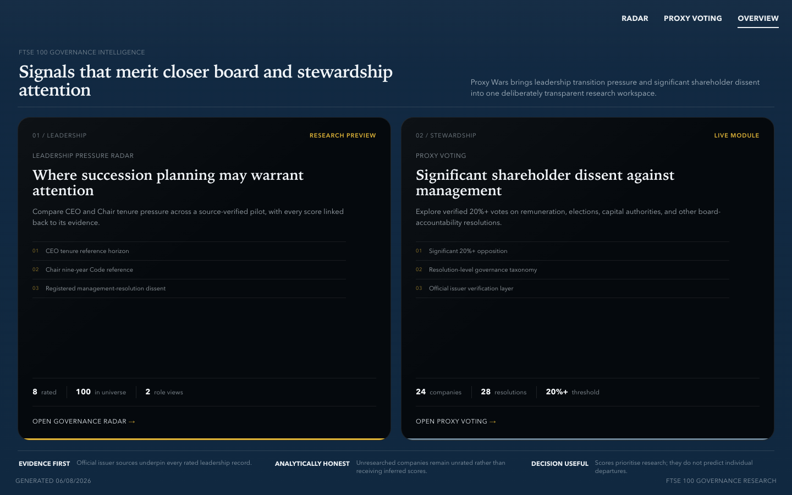
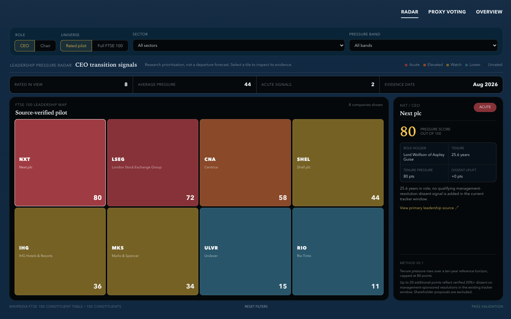

# Proxy Wars

Proxy Wars is a focused FTSE 100 governance research portfolio project. It now contains two connected modules:

- **Leadership Pressure Radar**: a source-backed research preview that prioritises CEO and Chair succession signals.
- **Proxy Voting**: a resolution-level tracker for significant shareholder dissent against management.

The product is intentionally transparent about scope. Leadership evidence now covers the current 100-company roster; externally managed issuers without a company CEO are marked not applicable, and the voting module covers significant dissent rather than general AGM voting books.

## Preview





## Current coverage

### Leadership Pressure Radar

- Universe: a 100-company FTSE 100 public constituent snapshot.
- Leadership coverage: all 100 companies have official issuer sources for current CEO and Chair appointments or a sourced structural `not applicable` designation.
- Signals in methodology `v0.5`: role tenure, qualifying registered dissent, source-verified profit-warning evidence, and officially announced live CEO or Chair succession processes.
- Profit-warning audit: 50 companies reviewed over 36 months, with 11 qualifying official events across nine issuers.
- Succession review: all 100 companies reviewed, with seven live processes captured in the current evidence window.
- Market-performance pilot: ten companies with monthly share-price and dividend-adjusted returns against the FTSE 100 price index.
- Profile pilot: the same ten companies have concise sourced CEO/Chair biographies, official links, and local issuer assets where stable.
- Excluded for now: activism, controversies, broader news, and any unlicensed claim to institutional-grade TSR.
- Output: `public/data/leadership-radar.json`.

The score is a research-prioritisation device, not a prediction that an individual will leave office. Full details are in [the radar methodology](docs/leadership-radar-methodology.md).

### Proxy Voting

- 28 real significant-dissent resolutions across 24 matched FTSE 100 issuers in the current dataset.
- Primary layer: [Investment Association Public Register](https://www.theia.org/public-register).
- Verification layer: official issuer announcements and selected issuer-published AGM result PDFs.
- Focus: 20%+ opposition on remuneration, director elections, capital authorities, and other board-accountability resolutions.
- Output: `public/data/tracker-data.json`.

The IA Public Register stopped adding new cases after its October 2025 policy change. It remains useful as a historical base, but future Proxy Voting expansion depends on direct issuer sources.

## Stack

- React 19, TypeScript, and Vite
- React Router
- Recharts for Proxy Voting charts
- Python, Requests, Beautiful Soup, and pypdf for data ingestion
- Static JSON storage in the repository
- Vercel-ready static deployment

## Run locally

```bash
npm install
python3 -m pip install -r requirements.txt
npm run data
npm run dev
```

Open the local URL printed by Vite, normally `http://localhost:5173`.

Create a production build with:

```bash
npm run build
```

## Data refresh

`npm run data` performs the connected builds:

1. Refreshes and verifies the significant-dissent dataset.
2. Fetches the public FTSE 100 roster snapshot, falling back to the cached snapshot if unavailable.
3. Joins both manually verified leadership source files and validates exact 100-company roster coverage.
4. Validates the 50-company profit-warning review and joins approved official warning evidence.
5. Validates exact 100-company coverage for official active-succession review.
6. Recalculates role-specific pressure scores without allowing either overlay to change the score.
7. Refreshes and validates the ten-company monthly market-performance pilot.
8. Runs validation before writing the public JSON files.

The GitHub Actions workflow in `.github/workflows/refresh-data.yml` runs weekly and can also be triggered manually. It refreshes calculations, the constituent roster, and the market pilot, then checks 100 official issuer pages for new earnings- and succession-related links. Matches enter a typed review queue and never alter the radar automatically. Verified appointments, qualifying warning events, and active succession cases must still be approved in their source files before publication.

Run the monitor independently with `npm run data:monitor`. Its source health and editorial safeguards are explained in [the monitor methodology](docs/announcement-monitor-methodology.md).

## Project structure

```text
data/
  leadership_sources.json          # manually verified leadership evidence
  leadership_sources_expansion.json # second 50-company evidence cohort
  profit_warning_sources.json      # curated official warning events
  profit_warning_reviews.json      # warning-audit outcomes and official sources
  succession_sources.json          # official active-succession evidence
  announcement_monitor_sources.json # official issuer monitoring configuration
  announcement_monitor_snapshot.json # previously seen announcement links
  announcement_review_queue.json  # candidates awaiting editorial review
  ftse100_constituents.json        # generated public roster snapshot
  company_metadata.json            # Proxy Voting issuer aliases
  issuer_source_config.json        # direct voting-source seeds
docs/
  leadership-radar-methodology.md
  announcement-monitor-methodology.md
  project-log.md
public/data/
  leadership-radar.json
  market-performance.json
  leadership-profiles.json
  tracker-data.json
scripts/
  build_leadership_radar.py
  build_market_performance.py
  build_dataset.py
src/
  pages/LeadershipRadarPage.tsx
  pages/DashboardPage.tsx
```

## Analytical limitations

- All 100 companies are source verified; six externally managed issuers have no issuer CEO and are not scored for that role.
- CEO tenure has no formal UK governance limit; the ten-year horizon is an analytical reference only.
- Chair tenure is interpreted in the context of the Code's nine-year independence and succession guidance.
- The dissent uplift is based on a narrow 2025 source window, not complete historical voting coverage.
- The profit-warning audit covers 50 companies; no-warning interpretation remains limited to that reviewed subset.
- Warning and succession evidence are excluded from the score pending calibration and outcome testing.
- A public constituent table is used for reproducibility and is not an official FTSE Russell feed.
- Classification and parsing rules remain suitable for a portfolio MVP, not a commercial proxy-research service.
- Yahoo adjusted close is used only as a transparent dividend-adjusted research proxy; it is not a licensed total-return index and excludes tax, costs, and currency effects.

## Product roadmap

- Extend the profit-warning audit from 50 to all 100 constituents.
- Improve monitor reliability where official sites block automated access or render no usable links.
- Extend the source-backed profile and market-performance pilots beyond ten companies.
- Evaluate warning and succession score contributions only after back-testing, sensitivity analysis, and a documented governance rationale.

## Verification

The current build is checked with:

```bash
npm run data:radar
npm run lint
npm run build
```
